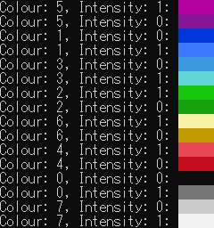

# cmd.h

v0.13(2019-11-01)

> ※Please include windows.h and link the winmm.dll library (for MinGW add `-lwinmm`).

### ConsoleColour()

Sets console text colour using [SetConsoleTextAttribute()](https://docs.microsoft.com/en-us/windows/console/setconsoletextattribute) from [windows.h](https://docs.microsoft.com/en-gb/windows/console/)

| *int* foreground |
| ---------------- |
| 0: Black         |
| 1: Blue          |
| 2: Green         |
| 3: Cyan          |
| 4: Red           |
| 5: Magenta       |
| 6: Yellow        |
| 7: White         |
| default: White   |

| *int* background |
| ---------------- |
| 0: Black         |
| 1: Blue          |
| 2: Green         |
| 3: Cyan          |
| 4: Red           |
| 5: Magenta       |
| 6: Yellow        |
| 7: White         |
| default: White   |

`int foreground_intensity`

0: False
1: True
default: False

`int background_intensity`

0: False
1: True
default: False

### CursorVisibility()
Changes console cursor visibility using [SetConsoleCursorInfo()](https://docs.microsoft.com/en-us/windows/console/setconsolecursorinfo) from [windows.h](https://docs.microsoft.com/en-gb/windows/console/)

`int visibility`

0: invisible
1: visible
default: visible

### CursorPosition()
Changes cursor position using [SetConsoleCursorPosition()](https://docs.microsoft.com/en-us/windows/console/setconsolecursorposition) [windows.h](https://docs.microsoft.com/en-gb/windows/console/)

`int x`

x coord (>= 0)
default: 0

`int y`

y coord (>= 0)
default: 0

### Startup()
Changes the screen size, hides the cursor, sets the console encoding to utf-8 and sets the console title

`int height`

window height (>= 0)
default: 0

`int width`

window width (>= 0)
default: 0

`char title`

console title

### PlayAudio()
Uses [mciSendString()](https://docs.microsoft.com/en-us/previousversions/dd757161(v%3Dvs.85)) to play sounds.

`char path`

path to audio file(mp3)

`int repeat`

0: false
1: true
default: 0

### PauseAudio()
Uses [mciSendString()](https://docs.microsoft.com/en-us/previousversions/dd757161(v%3Dvs.85)) to pause sounds.

`char path`

path to audio file(mp3)

### ResumeAudio()
Uses [mciSendString()](https://docs.microsoft.com/en-us/previousversions/dd757161(v%3Dvs.85)) to resume paused sounds.

`char path`

path to audio file(mp3)

### StopAudio()

Uses [mciSendString()](https://docs.microsoft.com/en-us/previousversions/dd757161(v%3Dvs.85)) to stop paused sounds.

`char path`

path to audio file(mp3)