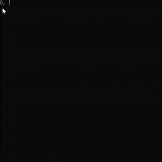
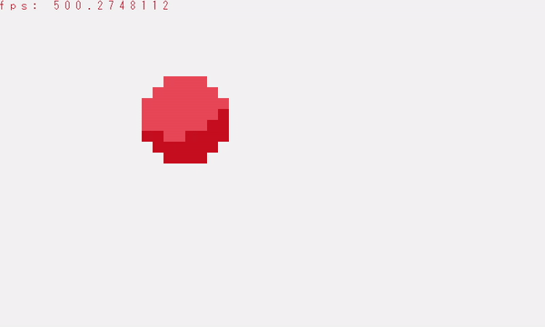
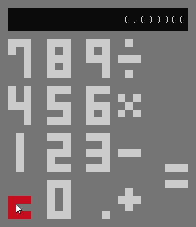

<p align="center">
  
  <h3 align="center"><b>kaliumn</b></h1>
  <p align="center">A simple single-header-file library that makes it easier to develop Windows console applications with c</p>
  <p align="center">
     
  </p>
</p>

----

<br>

>This library is still in a very early state. **Any feedback is welcome!**

### Compiling

Include kaliumn.h with your project and link *winmm* when compiling.

At the top of your c file:

```c
#include "kaliumn.h"
```

When compiling (MinGW):

```
gcc [file-name].c -o [file-name] -lwinmm
```

### Usage

*Please refer to [Wiki/Basics](https://github.com/k390983/kaliumn/wiki#basicschange-the-text-color).*

### Examples

<p align="center"><br><b>get mouse position relative to screen</b></p>
<p align="center"><br><b>display and animate textures with high fps</b></p>
<p align="center"><br><b>make a simple gui with minimal code</b></p>

*For more examples and code see [Wiki/Examples](https://github.com/k390983/kaliumn/wiki/Examples).*

### Texture Editor (wip)
The Texture Editor can bu used to easily make textures that can be used by Draw().    
*Please refer to the [Wiki](https://github.com/k390983/cmd.h/wiki) for more imformation.*

### Contributing
Any contributions are **greatly appreciated**.

1. Fork the Project
2. Create your Feature Branch (`git checkout -b feature/cmd.h`)
3. Commit your Changes (`git commit -m 'Add some cmd.h'`)
4. Push to the Branch (`git push origin feature/cmd.h`)
5. Open a Pull Request

----

k390983(https://github.com/k390983) - kaikitagawajones@gmail.com    
Distributed under the MIT license. See `LICENSE` for more information.
